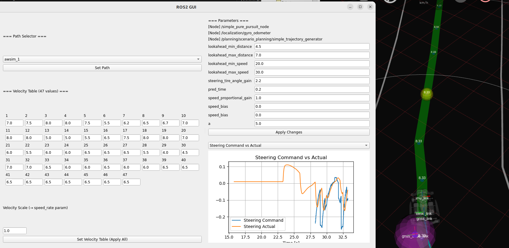

# はじめに
決勝大会では20分間という短い間で用意してきた経路やパラメータを試す必要が有ります。  
そのため、SSHが行った走行中にパラメータ変更する方法を調整します。
# 用いる手法
[こちら](https://qiita.com/soyaoki/items/aebad31500e34019d832)のとっとこちゅら太郎 さんの記事を参考に、ros2 param コマンドを用いて動的にパラメータを変更します。余談ですが練習会ではこのようなGUIを作成し、各種パラメータ、速度テーブルの変更とステア角のリアルタイムでの監視ができるようにしていました。

